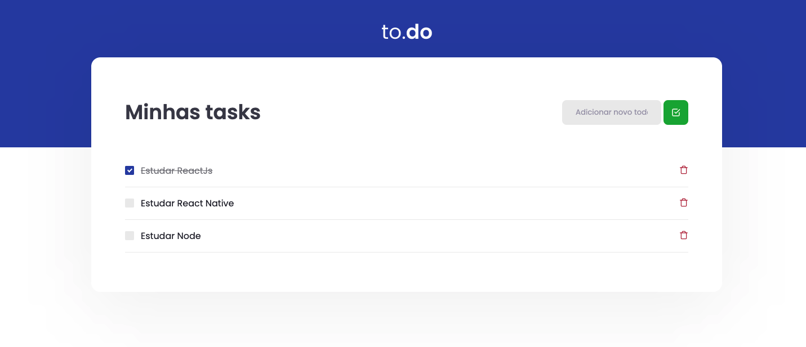

<h1 align="center">
 Desafio 01: Conceitos React - TODO 
</h1>

<p align="center">
  

  <a href="https://www.linkedin.com/in/luanyata/">
    
  </a>

  

  <a href="https://github.com/luanyata/Todo-Ignite/stargazers">
    
  </a>
</p>


# 💻 Sobre o desafio

Nesse desafio, você deverá criar uma aplicação para treinar o que aprendeu até agora no ReactJS

Essa será uma aplicação onde o seu principal objetivo é uma pequena aplicação de atividades a fazer, para treinar um pouco mais sobre manipulação do estado no React.

- Adicionar uma nova tarefa
- Remover uma tarefa
- Marcar e desmarcar uma tarefa como concluída

A seguir veremos com mais detalhes o que e como precisa ser feito 🚀

---
## A aplicação

Você deve criar as funcionalidades para as três funções presentes nesse arquivo, que são:

- **handleCreateNewTask**: Deve ser possível adicionar uma nova task no estado de `tasks`, com os campos `id` que deve ser gerado de forma aleatória, `title` que deve ser um texto e `isComplete` que deve iniciar como false.
- **handleToggleTaskCompletion:** Deve alterar o status de `isComplete` para uma task com um ID específico que é recebido por parâmetro.
- **handleRemoveTask:** Deve receber um ID por parâmetro e remover a task que contém esse ID do estado.

---
## Especificação dos testes

Em cada teste, tem uma breve descrição no que sua aplicação deve cumprir para que o teste passe.


Para esse desafio, temos os seguintes testes:

### Teste TaskList.spec.tsx

- **should be able to add a task**

Para que esse teste passe, você deve permitir que task seja criada e com isso, exibida em tela. As taks criadas devem conter os atributos seguindo o padrão da interface, que é:

```tsx
interface Task {
  id: number;
  title: string;
  isComplete: boolean;
}
```

- **should not be able to add a task with an empty title**

Para que esse teste passe, antes de criar uma nova task, você deve validar se algo foi digitado no input e não permitir a criação da task caso o valor seja vazio, caso o valor digitado seja vazio, você deve impedir a criação da task.

- **should be able to remove a task**

Para que esse teste passe, você deve permitir que ao clicar no botão com ícone de uma lixeira, a task relacionada a esse botão seja removida do estado da aplicação, consequentemente sendo removida da tela.

- **should be able to check a task**

Para que esse teste passe, você deve permitir que ao clicar no checkbox ao lado da task, ela seja marcada como concluída ou não concluída de acordo com seu estado atual, alterando seu valor de `isComplete` de `false` para `true` ou ao contrário, de `true` para `false`. 


Feito com 💜 por Rocketseat 👋 Participe da nossa [comunidade aberta!](https://discord.gg/pUU3CG4Z)
